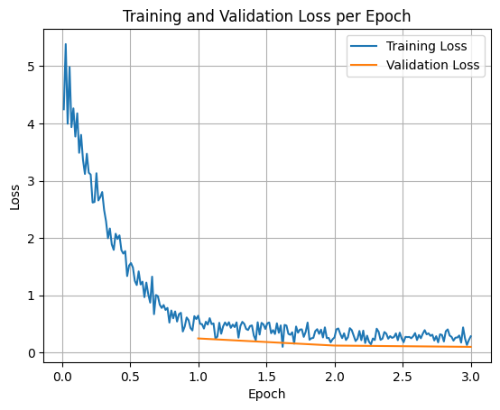

# FoodExpert: Food Text Extraction & Tagging

FoodExpert is a specialized text analysis tool powered by a fine-tuned small large language model (LLM). It is designed to automatically categorize, extract, and tag food-related text into structured categories (such as recipes, nutrition panels, ingredient lists, menus, etc.).

The project provides both a command-line interface (CLI) and a web-based user interface (built with Streamlit) to facilitate real-time inference and text tagging.

---

## 🚀 Model Details & Hugging Face Repository

The core model is a Parameter-Efficient Fine-Tuned (PEFT/LoRA) version of Google's **Gemma 3 (270M Instruct)** model, optimized specifically for high-accuracy food text domain classification and entity grouping.

- **Base Model:** `google/gemma-3-270m-it`
- **Fine-Tuned Model (v2):** [RahulKate-173/FoodExtract-gemma-3-270m-fine-tune-peft-v2](https://huggingface.co/RahulKate-173/FoodExtract-gemma-3-270m-fine-tune-peft-v2)

---

## 🏷️ Supported Tags & Classifications

The fine-tuned model processes input text and maps it to one or more of the following standard food domain tags:

| Tag Code | Tag Name | Description |
| :---: | :--- | :--- |
| **`np`** | `nutrition_panel` | Nutrition facts, calorie counts, daily values, macro/micronutrient breakdown. |
| **`il`** | `ingredient_list` | Bulleted or comma-separated lists of food ingredients/components. |
| **`me`** | `menu` | Restaurant menus, dish names, pricing, and restaurant offerings. |
| **`re`** | `recipe` | Cooking instructions, culinary directions, preparation steps, and yields. |
| **`fi`** | `food_items` | General food products, snacks, whole foods, and solid items. |
| **`di`** | `drink_items` | Beverages, juices, soft drinks, alcohol, coffee, and liquid refreshments. |
| **`fa`** | `food_advertistment`| Marketing material, promotional copy, food discounts, and billboard text. |
| **`fp`** | `food_packaging` | Product labels, warnings, allergen notifications, or outer-box text elements. |

---

## 📈 Training Performance & Convergence

The model was fine-tuned using LoRA adapters over **3 epochs**. As seen in the training history below, both the training loss and validation loss decreased smoothly and steadily, showing strong convergence without signs of overfitting.

### Loss Curve


---

## 🛠️ Installation & Environment Setup

### 1. Clone the Repository
```bash
git clone <repository-url>
cd FoodExpert
```

### 2. Install Dependencies
Ensure you have Python 3.9+ installed, then install the required libraries:
```bash
pip install -r requirements.txt
```

### 3. Configure Hugging Face Token
Since the fine-tuned model resides on a Hugging Face repository, you need an authorized Hugging Face token (`HF_TOKEN`) to download the adapters and interact with the Hugging Face Hub API.

Create a `.env` file in the root directory based on the `.env.example`:
```bash
cp .env.example .env
```
Open `.env` and fill in your actual Hugging Face token:
```env
HF_TOKEN = "your_actual_huggingface_token_here"
```

---

## 💻 How to Use

FoodExpert supports two execution modes:

### 1. Interactive CLI Mode
Run the command-line interface script to input text prompts directly through the console:
```bash
python main.py
```
**Usage Example:**
```text
Enter text :
1 cup whole oats, 1 tbsp chia seeds, 1 cup almond milk. Boil for 5 minutes.

[INFO] Input :
 1 cup whole oats, 1 tbsp chia seeds, 1 cup almond milk. Boil for 5 minutes.
[INFO] Outputs generated!!
[INFO] Output :
re
```

### 2. Interactive Web UI (Streamlit App)
Launch a clean, responsive graphical web user interface to paste text, view predictions, and analyze food domains visually:
```bash
streamlit run app.py
```
Once executed, open the local URL provided in your terminal (usually `http://localhost:8501`).

---

## 📂 Project Structure

```text
FoodExpert/
├── .env.example           # Template for environment variables (HF_TOKEN)
├── app.py                 # Streamlit Web Application interface
├── main.py                # Console/CLI inference script
├── requirements.txt       # Python package dependencies
├── loss_curve.png         # Epoch vs Loss visualization curve chart
└── notebooks/             # Experimental and fine-tuning Jupyter notebooks
    ├── fine_tuning_small_llm.ipynb
    ├── FineTuning_llm_playground02_inference.ipynb
    └── Finetuning_smallLLM_playground02_peft.ipynb
```

---

## 🧪 Fine-Tuning Workflow
The full training procedure, data preprocessing pipeline, and parameter configurations (LoRA rank, alpha, target modules, learning rate, and optimizer settings) can be explored step-by-step within the notebooks folder:
- **`notebooks/fine_tuning_small_llm.ipynb`**: Contains full dataset tokenization, PEFT/LoRA configuration setup, and the training loop execution.
- **`notebooks/FineTuning_llm_playground02_inference.ipynb`**: Used for testing checkpoint quality and running post-training validation tests.
